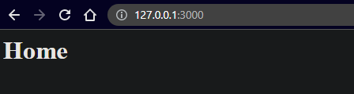
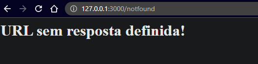

# HTTP Server utilizando Node.Js

##### Adicionando 7 rotas para o servidor local


###### Variáveis de configuração

* **http:** para usar HTTP server e client é necessário utilizar `require('http')`. As interfaces HTTP no Node.js são projetadas para suportar muitos recursos do protocolo que têm sido tradicionalmente difíceis de usar.
* **port:** porta especificada para rodar o servidor
* **ip:** tipo de host utilizada para utilização do servidor
* **server:** modelo de servidor construído para receber as requisições e as respostas


###### Rotas

1. **'/'** - rota padrão com resposta `<h1>Home</h1>`
2. **'/cadastro'** - rota com resposta `<h1>Cadastro</h1>`
3. **'/conteudo'** - rota com resposta `<h1>Conteudo</h1>`
4. **'/local'** - rota com resposta `<h1>Local</h1>`
5. **'/contato'** - rota com resposta `<h1>Contato</h1>`
6. **'/notfound'** - rota com resposta `<h1>URL sem resposta definida!</h1>`


###### URL do servidor com a porta

```
http://localhost:3000
```

tp definida como localhost

porta definida como 3000


###### Imagens





